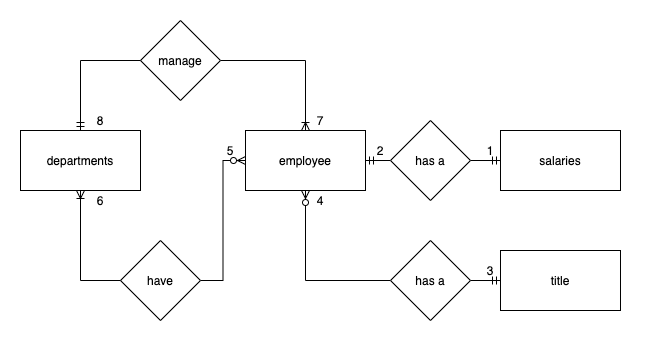

# Conceptual Database Design



## Assumption:

1. An employee has one and only one salary

- An employee can only have one salary
- An employee with zero salary with record 0 in salary table

2. A salary is related to one and only one employee

- Salaries with no employee will not added to the database
- Each salary record connected to one employee

3. An employee has one and only on title
4. One title can apply to one and many employee

- Many employee can have the same title

5. A department has zero and many employee

- A department can be added to database before having any employee
- A department can have one and many employee

6.  An employee can belong to one and many department

- An employee can work on multi departements

7. A department has one and many managers/employee
8. A manager/employee manage one and only one department

## Relationship:

- employee and salaries: one to one relatioinship

- employee and title: one to many relationship

- employee and departments: Many to Many relationship

- employee/manager and department: one to many employee

# Logical database design


## Using quickDBD


# Create tables

```sql
CREATE TABLE title (
	title_id VARCHAR(10) PRIMARY KEY,
	title VARCHAR(20)
);

CREATE TABLE departments (
	dept_no VARCHAR(10) PRIMARY KEY,
	dept_name VARCHAR(30)
);


CREATE TABLE employee (
	emp_no INTEGER PRIMARY KEY,
	emp_title_id VARCHAR(10) NOT NULL,
	birth_date DATE,
	first_name VARCHAR(30),
	last_name VARCHAR(30),
	sex VARCHAR(1),
	hire_date DATE,
	FOREIGN KEY(emp_title_id) REFERENCES title(title_id)
);

CREATE TABLE salaries (
	emp_no INTEGER PRIMARY KEY,
	salary INTEGER,
	FOREIGN KEY(emp_no) REFERENCES employee(emp_no)
);

CREATE TABLE dept_emp (
	emp_no INTEGER,
	dept_no VARCHAR(10),
	PRIMARY KEY(emp_no, dept_no),
	FOREIGN KEY(emp_no) REFERENCES employee(emp_no),
	FOREIGN KEY(dept_no) REFERENCES departments(dept_no)
);


CREATE TABLE dept_manager (
	emp_no INTEGER,
	dept_no VARCHAR(10),
	PRIMARY KEY(emp_no, dept_no),
	FOREIGN KEY(emp_no) REFERENCES employee(emp_no),
	FOREIGN KEY(dept_no) REFERENCES departments(dept_no)
);
```

# Import data to the database

```sql
-- Step 1, import title data
COPY title
FROM '/Users/simonxu/data_du/hw/09-SQL/data/titles.csv'
DELIMITER ',' CSV HEADER;

SELECT * FROM title;

-- Step 2, import departments data
COPY departments
FROM '/Users/simonxu/data_du/hw/09-SQL/data/departments.csv'
DELIMITER ',' CSV HEADER;

SELECT * FROM departments;

-- Step 3, import employee data
COPY employee
FROM '/Users/simonxu/data_du/hw/09-SQL/data/employees.csv'
DELIMITER ',' CSV HEADER;

SELECT * FROM employee
LIMIT 10;

-- STEP 4, import salary data
COPY salaries
FROM '/Users/simonxu/data_du/hw/09-SQL/data/salaries.csv'
DELIMITER ',' CSV HEADER;

SELECT * FROM salaries
LIMIT 10;

-- STEP 5, import dept_emp data
COPY dept_emp
FROM '/Users/simonxu/data_du/hw/09-SQL/data/dept_emp.csv'
DELIMITER ',' CSV HEADER;

SELECT * FROM dept_emp
LIMIT 10;

-- STEP 6, import dept_manager data
COPY dept_manager (dept_no, emp_no)
FROM '/Users/simonxu/data_du/hw/09-SQL/data/dept_manager.csv'
DELIMITER ',' CSV HEADER;

SELECT * FROM dept_manager;
```

# Query

1. List the following details of each employee: employee number, last name, first name, sex, and salary.

```sql
SELECT e.emp_no, e.last_name, e.first_name, e.sex, s.salary
FROM employee AS e
JOIN salaries AS s
	ON e.emp_no = s.emp_no
;
```

2. List first name, last name, and hire date for employees who were hired in 1986.

```sql
SELECT first_name, last_name, hire_date
FROM employee
WHERE hire_date BETWEEN '1986-01-01' AND '1986-12-31';
```

3. List the manager of each department with the following information: department number, department name, the manager's employee number, last name, first name.

```sql
SELECT d.dept_no, d.dept_name, e.emp_no, e.last_name, e.first_name
FROM departments AS d
JOIN dept_manager AS dm
	ON d.dept_no = dm.dept_no
JOIN employee AS e
	ON dm.emp_no = e.emp_no;
```

4. List the department of each employee with the following information: employee number, last name, first name, and department name.

```sql
SELECT de.emp_no, e.last_name, e.first_name, d.dept_name
FROM dept_emp AS de
JOIN employee AS e
	ON de.emp_no = e.emp_no
JOIN departments AS d
	ON de.dept_no = d.dept_no
;
```

5. List first name, last name, and sex for employees whose first name is "Hercules" and last names begin with "B."

```sql
SELECT first_name, last_name, sex
FROM employee
WHERE first_name = 'Hercules'
	AND
	  last_name LIKE 'B%'
;
```

6. List all employees in the Sales department, including their employee number, last name, first name, and department name.

```sql
SELECT dept_emp.emp_no, dept_emp.last_name, dept_emp.first_name, dept_emp.dept_name
FROM (
	SELECT de.emp_no, e.last_name, e.first_name, d.dept_name
	FROM dept_emp AS de
	JOIN employee AS e
		ON de.emp_no = e.emp_no
	JOIN departments AS d
		ON de.dept_no = d.dept_no
) AS dept_emp
WHERE dept_emp.dept_name = 'Sales';
```

7. List all employees in the Sales and Development departments, including their employee number, last name, first name, and department name.

```sql
SELECT dept_emp.emp_no, dept_emp.last_name, dept_emp.first_name, dept_emp.dept_name
FROM (
	SELECT de.emp_no, e.last_name, e.first_name, d.dept_name
	FROM dept_emp AS de
	JOIN employee AS e
		ON de.emp_no = e.emp_no
	JOIN departments AS d
		ON de.dept_no = d.dept_no
) AS dept_emp
WHERE dept_emp.dept_name IN ('Sales', 'Development');
```

8. In descending order, list the frequency count of employee last names, i.e., how many employees share each last name.

```sql
SELECT last_name, COUNT(last_name) AS count_last_name
FROM employee
GROUP BY last_name
ORDER BY count_last_name DESC;
```

# The histogram to visualize the most common salary ranges for employees.

## The Most common salary range is around from 40000 to 44000


# The bar chart of average salary by title.


